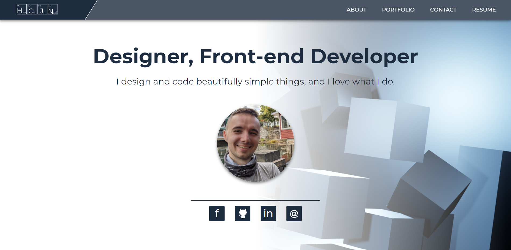
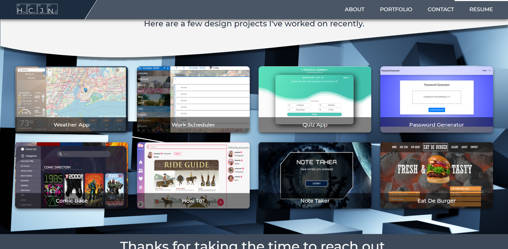

### Portfolio page of the Volodymyr Baisa

In this assignment, you'll build a professional portfolio site using HTML/CSS. These instructions include a short style guide; follow it to design an aesthetically pleasing layout while creating different kinds of complex HTML elements.

## Folder Structure

```
C:.
│   index.html
│   README.md
│
├───.vscode
│       settings.json
│
├───assets
│   └───img
│           1.png
│           2.png
│
├───css
│       style.css
│       style.css.map
│       style.scss
│       _about.scss
│       _contact.scss
│       _global.scss
│       _hero.scss
│       _phone.scss
│       _portfolio.scss
│       _tablet.scss
│
├───img
│       background-1.png
│       background-2.png
│       background-about.png
│       comic-base.png
│       eat_de_burger.png
│       me.png
│       note_taker.png
│       password-generator.png
│       project2.png
│       quiz-app.png
│       weather-app.png
│       work-scheduler.png
│
└───js
        app.js
```

### Built With

-   HTML
-   SASS
-   JavaScript
-   jQuery




## Web Site Link

https://volodymyrbaisa.github.io/MyPortfolio/
